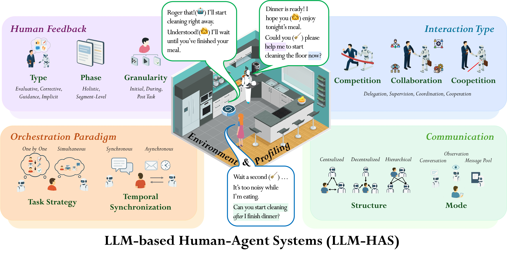
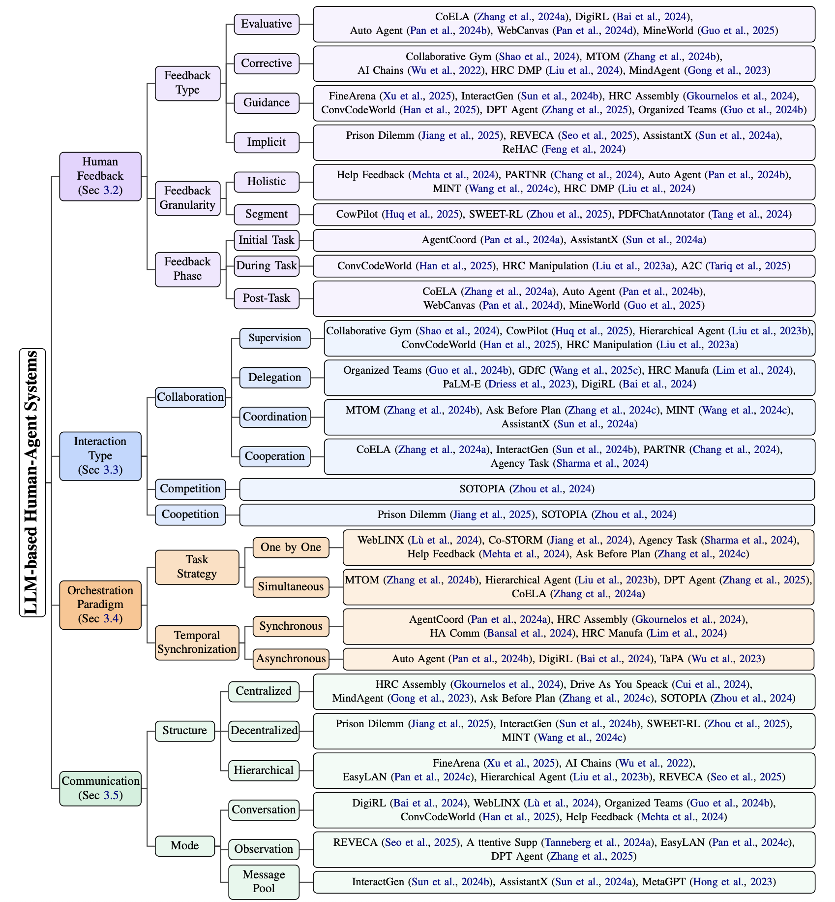

# Awesome LLM-Based Human-Agent Collaboration and Interaction Systems


[](https://arxiv.org/abs/2505.00753)
[]()
[]()

[](https://github.com/HenryPengZou/Awesome-Human-Agent-Collaboration-Interaction-Systems)

<p align="center">
    
</p>

Welcome to Awesome-Human-Agent-Collaboration-Interaction-Systems! 🚀 This repository serves as your comprehensive guide to the cutting-edge world of LLM-Based Human-Agent Collaboration and Interaction Systems. We've meticulously curated a collection of resources for you.




## 🌟 Introduction

Recent advances in large language models (LLMs) have sparked growing interest in building fully autonomous agents. However, **fully autonomous LLM-based agents** still face significant challenges, including ***limited reliability due to hallucinations***, ***difficulty in handling complex tasks***, and ***substantial safety and ethical risks***, all of which limit their feasibility and trustworthiness in real-world applications.

**LLM-based human-agent collaboration systems are interactive frameworks where humans actively provide** ***additional information***, ***feedback***, or ***control*** during interaction with LLM-powered agents to *enhance system performance, reliability, and safety*. These human-agent collaboration systems enable humans and LLM-based agents to collaborate effectively by leveraging their complementary strengths. For a detailed introduction, please refer to our survey paper: [LLM-Based Human-Agent Collaboration and Interaction Systems: A Survey](https://arxiv.org/abs/2505.00753). 

Our goal with this project is to build an exhaustive collection of awesome resources relevant to LLM-HAS encompassing papers, repositories, and more to foster further research and innovation in this rapidly evolving interdisciplinary field of human-ai collaboration.


<div id="contents"></div>

<!-- omit in toc -->
## 📄 Contents

- [📄 Latest Research Papers](#-latest-research-papers)
- [🔍 Taxonomy](#-taxonomy)
    - [🤝 Human Feedback](#-human-feedback)
    - [🔄 Interaction](#-interaction)
    - [🎛️ Orchestration](#️-orchestration)
    - [💬 Communication](#-communication)
- [📚 Applications, Datasets & Benchmarks](#-applications-datasets--benchmarks)
    - [🤖 Emobodied AI, Robotics](#-emobodied-ai-robotics)
    - [💻 Software Engineering, Coding](#-software-engineering-coding)
    - [💬 Conversation System](#-conversation-system)
    - [🎮 Gaming](#-gaming)
    - [💰 Finance](#-finance)
    - [🏥 Healthcare, Medicine](#-healthcare-medicine)
- [📌 Contributing](#-contributing)
- [📝 Citation](#-citation)


## 📄 Latest Research Papers
 ([©️click here back to table of contents👆🏻](#contents))

🤗 *Contributions are welcome! If you have recommended papers and resources, please submit pull requests or open issues.*

- [11 Jun 2025] [[arXiv 2025]](https://arxiv.org/abs/2506.09420) **A Call for Collaborative Intelligence: Why Human-Agent Systems Should Precede AI Autonomy** [](https://github.com/HenryPengZou/Awesome-Human-Agent-Collaboration-Interaction-Systems)

- [6 Jun 2025] [[arXiv 2025]](https://arxiv.org/abs/2506.06576) **Future of Work with AI Agents: Auditing Automation and Augmentation Potential across the U.S. Workforce** [](https://github.com/SALT-NLP/workbank)

- [5 May 2025] [[arXiv 2025]](https://web3.arxiv.org/abs/2505.02418) **SymbioticRAG: Enhancing Document Intelligence Through Human-LLM Symbiotic Collaboration** 

- [1 May 2025] [[arXiv 2025]](https://arxiv.org/abs/2505.00753) **LLM-Based Human-Agent Collaboration and Interaction Systems: A Survey** [](https://github.com/HenryPengZou/Awesome-Human-Agent-Collaboration-Interaction-Systems)

- [10 Mar 2025] [[arXiv 2025]](https://arxiv.org/abs/2503.07320) **Experimental Exploration: Investigating Cooperative Interaction Behavior Between Humans and Large Language Model Agents** 

- [4 Mar 2025] [[arXiv 2025]](https://arxiv.org/abs/2503.02692) **FinArena: A Human-Agent Collaboration Framework for Financial Market Analysis and Forecasting** 

- [13 Apr 2025] [[arXiv 2025]](https://arxiv.org/abs/2504.09689) **EmoAgent: Assessing and Safeguarding Human-AI Interaction for Mental Health Safety** [](https://github.com/1akaman/EmoAgent)

- [11 Apr 2025] [[arXiv 2025]](https://arxiv.org/abs/2504.08388) **MineWorld: a Real-Time and Open-Source Interactive World Model on Minecraft** [](https://github.com/microsoft/MineWorld)

- [4 Apr 2025] [[arXiv 2025]](https://arxiv.org/abs/2504.03601) **APIGen-MT: Agentic Pipeline for Multi-Turn Data Generation via Simulated Agent-Human Interplay**

- [19 Mar 2025] [[arXiv 2025]](https://arxiv.org/abs/2503.15478) **SWEET-RL: Training Multi-Turn LLM Agents on Collaborative Reasoning Tasks** [](https://github.com/facebookresearch/sweet_rl)

- [3 Mar 2025] [[ICML 2025]](https://openreview.net/forum?id=2Sl6Ex7Vmo) **M3HF: Multi-agent Reinforcement Learning from Multi-phase Human Feedback of Mixed Quality** [](https://github.com/facebookresearch/sweet_rl)

- [27 Feb 2025] [[ICLR 2025]](https://arxiv.org/abs/2502.19852) **ConvCodeWorld: Benchmarking Conversational Code Generation in Reproducible Feedback Environments** [](https://github.com/stovecat/convcodeworld)

- [17 Feb 2025] [[arXiv 2025]](https://arxiv.org/abs/2502.11882) **Leveraging Dual Process Theory in Language Agent Framework for Real-time Simultaneous Human-AI Collaboration** [](https://github.com/sjtu-marl/DPT-Agent)

- [2 Feb 2025] [[ICML 2025]](https://openreview.net/forum?id=DmH4HHVb3y) **CollabLLM: From Passive Responders to Active Collaborators** [](https://github.com/Wuyxin/collabllm)

- [28 Jan 2025] [[arXiv 2025]](https://arxiv.org/abs/2501.16609) **CowPilot: A Framework for Autonomous and Human-Agent Collaborative Web Navigation**

- [25 Dec 2024] [[IROS 2024]](https://ieeexplore.ieee.org/abstract/document/10801517) **To Help or Not to Help: LLM-based Attentive Support for Human-Robot Group Interactions** [](https://github.com/HRI-EU/AttentiveSupport)

- [20 Dec 2024] [[arXiv 2024]](https://arxiv.org/abs/2412.15701) **Collaborative Gym: A Framework for Enabling and Evaluating Human-Agent Collaboration** [](https://github.com/SALT-NLP/collaborative-gym)

- [8 Dec 2024] [[arXiv 2024](https://arxiv.org/abs/2412.05958)] **Towards Modeling Human-Agentic Collaborative Workflows: A BPMN Extension** [](https://github.com/BESSER-PEARL/agentic-bpmn)

- [26 Nov 2024][[arXiv 2024]](https://arxiv.org/abs/2412.06808) **Effect of Adaptive Communication Support on LLM-powered Human-Robot Collaboration** 

- [31 Oct 2024] [[ICLR 2025]](https://arxiv.org/abs/2502.11882) **PARTNR: A Benchmark for Planning and Reasoning in Embodied Multi-agent Tasks** [](https://github.com/facebookresearch/partnr-planner)

- [16 Oct 2024] [[ICLR 2025]](https://openreview.net/forum?id=sRIU6k2TcU) **Proactive Agent: Shifting LLM Agents from Reactive Responses to Active Assistance** [](https://github.com/thunlp/ProactiveAgent)

- [26 Sep 2024] [[arXiv 2024]](https://arxiv.org/abs/2409.17655) **AssistantX: An LLM-Powered Proactive Assistant in Collaborative Human-Populated Environment** [](https://github.com/AssistantX-Agent/AssistantX)

- [25 Sep 2024] [[arXiv 2024]](https://arxiv.org/abs/2409.17140) **AXIS: Efficient Human-Agent-Computer Interaction with API-First LLM-Based Agents** 

- [13 Sep 2024] [[arXiv 2024]](https://arxiv.org/abs/2409.08811) **Mutual Theory of Mind in Human-AI Collaboration: An Empirical Study with LLM-driven AI Agents in a Real-time Shared Workspace Task**

- [27 Aug 2024] [[EMNLP 2024]](https://aclanthology.org/2024.emnlp-main.554/) **Into the Unknown Unknowns: Engaged Human Learning through Participation in Language Model Agent Conversations** [](https://github.com/stanford-oval/storm)

- [12 July 2024] [[SME 2024]](https://www.sciencedirect.com/science/article/pii/S0278612525000731) **Human-LLM collaboration in generative design for customization**

- [20 Jun 2024] [[RAL 2024]](https://ieeexplore.ieee.org/document/10561501) **Enhancing the LLM-Based Robot Manipulation Through Human-Robot Collaboration** 

- [18 Jun 2024] [[EMNLP 2024]](https://aclanthology.org/2024.findings-emnlp.636/) **Ask-before-Plan: Proactive Language Agents for Real-World Planning** [](https://github.com/magicgh/Ask-before-Plan)

- [14 Jun 2024] [[NeurIPS 2024]](https://proceedings.neurips.cc/paper_files/paper/2024/hash/1704ddd0bb89f159dfe609b32c889995-Abstract-Conference.html) **DigiRL: Training In-The-Wild Device-Control Agents with Autonomous Reinforcement Learning** [](https://github.com/DigiRL-agent/digirl)

- [4 Jun 2024] [[CASE 2024]](https://ieeexplore.ieee.org/stamp/stamp.jsp?arnumber=10711843) **Enhancing Human-Robot Collaborative Assembly in Manufacturing Systems Using Large Language Models**

- [30 May 2024] [[arXiv 2024]](https://arxiv.org/abs/2405.20018) **Safe Multi-agent Reinforcement Learning with Natural Language Constraints**

- [27 May 2024] [[AAAI 2025]](https://arxiv.org/abs/2405.16751) **REVECA: Adaptive Planning and Trajectory-based Validation in Cooperative Language Agents using Information Relevance and Relative Proximity**

- [23 Apr 2024] [[NeurIPS 2024]](https://openreview.net/forum?id=DlYNGpCuwa) **Aligning LLM Agents by Learning Latent Preference from User Edits** [](https://github.com/gao-g/prelude)

- [19 Mar 2024] [[arXiv 2024]](https://arxiv.org/abs/2403.12482) **Embodied LLM Agents Learn to Cooperate in Organized Teams** [](https://github.com/tobeatraceur/Organized-LLM-Agents)

- [18 Apr 2024]] [[arXiv 2024]](https://arxiv.org/abs/2404.11943) **AgentCoord: Visually Exploring Coordination Strategy for LLM-based Multi-Agent Collaboration** [](https://github.com/AgentCoord/AgentCoord)

- [5 Apr 2024] [[IUI 2024]](https://openreview.net/forum?id=sRIU6k2TcU) **PDFChatAnnotator: A Human-LLM Collaborative Multi-Modal Data Annotation Tool for PDF-Format Catalogs**

- [8 Feb 2024] [[ICML 2024](https://arxiv.org/abs/2401.14432)] **WebLINX: Real-World Website Navigation with Multi-Turn Dialogue** [](https://github.com/McGill-NLP/WebLINX)

- [7 Feb 2024] [[NeurIPS 2024]](https://arxiv.org/abs/2402.04559) **Can Large Language Model Agents Simulate Human Trust Behavior?** [](https://github.com/camel-ai/agent-trust)

- [25 Jan 2024] [[arXiv 2024]](https://arxiv.org/abs/2401.14432) **A2C: A Modular Multi-stage Collaborative Decision Framework for Human-AI Teams**

- [18 Oct 2023] [[ICLR 2024]](https://openreview.net/forum?id=mM7VurbA4r) **SOTOPIA: Interactive Evaluation for Social Intelligence in Language Agents** [](https://github.com/sotopia-lab/sotopia)

- [18 Sep 2023] [[NAACL 2024]](https://aclanthology.org/2024.findings-naacl.200/) **MindAgent: Emergent Gaming Interaction** [](https://github.com/mindagent/mindagent)

- [1 Aug 2023] [[ICML 2023]](https://openreview.net/forum?id=VtmBAGCN7o) **MetaGPT: Meta Programming for A Multi-Agent Collaborative Framework** [](https://github.com/FoundationAgents/MetaGPT)

- [4 Jul 2023] [[ICML 2023]](https://arxiv.org/abs/2307.01848) **Embodied Task Planning with Large Language Models** [](https://github.com/Gary3410/TaPA)

- [1 Jun 2023] [[IEEE 2023]](https://ieeexplore.ieee.org/abstract/document/10141597) **Improved Trust in Human-Robot Collaboration With ChatGPT**

- [22 May 2023] [[EACL 2024]](https://aclanthology.org/2024.eacl-long.119/) **Investigating Agency of LLMs in Human-AI Collaboration Tasks** 

- [6 Mar 2023] [[ICML 2023]](https://openreview.net/forum?id=VTpHpqM3Cf&utm_campaign=The%20Batch&utm_source=hs_email&utm_medium=email&utm_content=284568789&_hsenc=p2ANqtz-9lsSL4nXMrOGBQqGoqktY5Yno_r9-nTOARZinDcgihFNqcOFEQb_MVtHKdpgI2AC3N8SrNW5PxcD0uxl4WeKcPJgUOgw) **PaLM-E: An Embodied Multimodal Language Model** [](https://github.com/kyegomez/PALM-E)

- [19 Sep 2023] [[WACV 2024]](https://arxiv.org/abs/2309.10228) **Drive as You Speak: Enabling Human-Like Interaction with Large Language Models in Autonomous Vehicles**

- [23 Dec 2023] [[AAMAS 2024]](https://arxiv.org/abs/2312.15224) **LLM-Powered Hierarchical Language Agent for Real-time Human-AI Coordination**

- [19 Sep 2023] [[ICLR 2024]](https://arxiv.org/abs/2309.10691) **MINT: Evaluating LLMs in Multi-turn Interaction with Tools and Language Feedback** [](https://github.com/xingyaoww/mint-bench)

- [5 Jul 2023] [[ICLR 2024]](https://arxiv.org/abs/2307.02485) **Building Cooperative Embodied Agents Modularly with Large Language Models** 

- [21 Apr 2023] [[EACL 2024]](https://arxiv.org/abs/2304.10750) **Improving Grounded Language Understanding in a Collaborative Environment by Interacting with Agents Through Help Feedback**


## 🔍 Taxonomy
 ([©️click here back to table of contents👆🏻](#contents))

For a detailed introduction of the taxonomy, please refer to Section 3 in our survey paper: [LLM-Based Human-Agent Collaboration and Interaction Systems: A Survey](https://arxiv.org/pdf/2505.00753). 



### 🤝 Human Feedback
 ([©️click here back to table of contents👆🏻](#contents))

| Title | Date & Code | Feedback Type | Feedback Subtype | Feedback Granularity | Feedback Phase |
| --- | :---: | :---: | :---: | :---: | :---: |
| [MineWorld: a Real-Time and Open-Source Interactive World Model on Minecraft](https://arxiv.org/abs/2504.08388) | [2025/04](https://github.com/microsoft/MineWorld) [](https://github.com/microsoft/MineWorld) | Evaluative | Scaler Rating | Holistic | Post Task |
| [Experimental Exploration: Investigating Cooperative Interaction Behavior Between Humans and Large Language Model Agents](https://arxiv.org/abs/2503.07320) | [2025/03](https://arxiv.org/abs/2503.07320) | Implicit | User Action | Segment | During Task |
| [SWEET-RL: Training Multi-Turn LLM Agents on Collaborative Reasoning Tasks](https://arxiv.org/abs/2503.15478) | [2025/03](https://github.com/facebookresearch/sweet_rl) [](https://github.com/facebookresearch/sweet_rl) | Corrective, Implicit | Refinement, User Action | Segment | During Task |
| [FinArena: A Human-Agent Collaboration Framework for Financial Market Analysis and Forecasting](https://arxiv.org/abs/2503.02692) | [2025/03](https://huggingface.co/datasets/Illogicaler/FinArena-low-cost-dataset) | Guidance | Demonstration | Segment | During Task |
| [Leveraging Dual Process Theory in Language Agent Framework for Real-time Simultaneous Human-AI Collaboration](https://arxiv.org/abs/2502.11882) | [2025/02](https://github.com/sjtu-marl/DPT-Agent) [](https://github.com/sjtu-marl/DPT-Agent) | Guidance | Critique | Holistic | During Task |
| [ConvCodeWorld: Benchmarking Conversational Code Generation in Reproducible Feedback Environments](https://arxiv.org/abs/2502.19852) | [2025/02](https://github.com/stovecat/convcodeworld) [](https://github.com/stovecat/convcodeworld) | Guidance  | Demonstration, Critique | Segment | During Task |
[CowPilot: A Framework for Autonomous and Human-Agent Collaborative Web Navigation](https://arxiv.org/abs/2501.16609) | [2025/01](https://oaishi.github.io/cowpilot.html) | Corrective, Implicit | User Action, Refinement | Segment | During Task |
| [Collaborative Gym: A Framework for Enabling and Evaluating Human-Agent Collaboration (Co-Gym)](https://arxiv.org/abs/2412.15701) | [2024/12](https://github.com/SALT-NLP/collaborative-gym) [](https://github.com/SALT-NLP/collaborative-gym) | Corrective | Refinement | Segment | During Task |
| [Towards Modeling Human-Agentic Collaborative Workflows: A BPMN Extension](https://arxiv.org/abs/2412.05958) | [2024/12](https://github.com/BESSER-PEARL/agentic-bpmn) [](https://github.com/BESSER-PEARL/agentic-bpmn) | Guidance | Demonstration | Holistic | Initial Setup, During Task, Post Task |
| [To Help or Not to Help: LLM-based Attentive Support for Human-Robot Group Interactions](https://ieeexplore.ieee.org/abstract/document/10801517) | [2024/10](https://github.com/HRI-EU/AttentiveSupport) [](https://github.com/HRI-EU/AttentiveSupport) | Implicit, Guidance | Demonstration, User Action | Holistic | Initial Setup, During Task |
| [PARTNR: A Benchmark for Planning and Reasoning in Embodied Multi-agent Tasks](https://openreview.net/forum?id=T5QLRRHyL1) | [2024/10](https://github.com/facebookresearch/partnr-planner/tree/main/) [](https://github.com/facebookresearch/partnr-planner/tree/main/) | Corrective, Guidance | Refinement, Critique | Holistic, Segment | During Task, Post Task |
| [AssistantX: An LLM-Powered Proactive Assistant in Collaborative Human-Populated Environment](https://arxiv.org/abs/2409.17655) | [2024/09](https://github.com/AssistantX-Agent/AssistantX) [](https://github.com/AssistantX-Agent/AssistantX) | Implicit | Human Control | Holistic | Initial Setup |
| [Mutual Theory of Mind in Human-AI Collaboration: An Empirical Study with LLM-driven AI Agents in a Real-time Shared Workspace Task](https://arxiv.org/abs/2409.08811) | [2024/09](https://arxiv.org/abs/2409.08811) | Corrective | Refinement | Segment | During Task |
| [Into the Unknown Unknowns: Engaged Human Learning through Participation in Language Model Agent Conversations](https://arxiv.org/abs/2408.15232) | [2024/08](https://github.com/stanford-oval/storm) [](https://github.com/stanford-oval/storm) | Guidance | Demonstration | Segment | During Task |
| [Human-LLM collaboration in generative design for customization](https://www.sciencedirect.com/science/article/abs/pii/S0278612525000731) | [2024/07](https://www.sciencedirect.com/science/article/abs/pii/S0278612525000731) | Guidance, Evaluative | Demonstration, Binary Assessment, Preference Ranking | Holistic, Segment | Initial Setup, Post Task |
| [WebCanvas: Benchmarking Web Agents in Online Environments](https://arxiv.org/pdf/2406.12373) | [2024/06](https://huggingface.co/datasets/iMeanAI/Mind2Web-Live) | Evaluative | Scaler Rating | Holistic | Post Task |
| [Enhancing Human-Robot Collaborative Assembly in Manufacturing Systems Using Large Language Models](https://arxiv.org/abs/2406.01915) | [2024/06](https://arxiv.org/abs/2406.01915) | Corrective, Guidance | Demonstration, Refinement, Critique | Segment | Initial Setup, During Task |
| [Enhancing the LLM-Based Robot Manipulation Through Human-Robot Collaboration](https://ieeexplore.ieee.org/abstract/document/10561501) | [2024/06](https://ieeexplore.ieee.org/abstract/document/10561501) | Corrective | Refinement | Holistic | During Task |
| [DigiRL: Training In-The-Wild Device-Control Agents with Autonomous Reinforcement Learning](https://arxiv.org/abs/2406.11896) | [2024/06](https://github.com/DigiRL-agent/digirl) [](https://github.com/DigiRL-agent/digirl) | Evaluative | Binary Assessment | Holistic | During Task, Post Task |
| [REVECA: Adaptive Planning and Trajectory-based Validation in Cooperative Language Agents using Information Relevance and Relative Proximity](https://arxiv.org/abs/2405.16751) | [2024/05](https://arxiv.org/abs/2405.16751) | Implicit | Human Control | Segment | During Task |
| [Autonomous Evaluation and Refinement of Digital Agents](https://arxiv.org/abs/2404.06474) | [2024/04](https://github.com/Berkeley-NLP/Agent-Eval-Refine) [](https://github.com/Berkeley-NLP/Agent-Eval-Refine) | Evaluative | Binary Assessment | Holistic | Post Task |
| [A Human-Computer Collaborative Tool for Training a Single Large Language Model Agent into a Network through Few Examples](https://arxiv.org/abs/2404.15974) | [2024/04](https://arxiv.org/abs/2404.15974) | Corrective, Guidance | Demonstration, Refinement | Segment | During Task |
| [AgentCoord: Visually Exploring Coordination Strategy for LLM-based Multi-Agent Collaboration](https://arxiv.org/abs/2404.11943) | [2024/04](https://github.com/AgentCoord/AgentCoord) [](https://github.com/AgentCoord/AgentCoord) | Guidance, Corrective | Demonstration, Refinement | Segment | Initial Setup |
| [PDFChatAnnotator: A Human-LLM Collaborative Multi-Modal Data Annotation Tool for PDF-Format Catalogs](https://dl.acm.org/doi/abs/10.1145/3640543.3645174) | [2024/04](https://dl.acm.org/doi/abs/10.1145/3640543.3645174) | Corrective, Guidance | Demonstration, Refinement | Segment | During Task |
| [Embodied LLM Agents Learn to Cooperate in Organized Teams](https://arxiv.org/abs/2403.12482) | [2024/03](https://github.com/tobeatraceur/Organized-LLM-Agents) [](https://github.com/tobeatraceur/Organized-LLM-Agents) | Guidance  | Critique | Holistic | During Task | 
| [Large Language Model-based Human-Agent Collaboration for Complex Task Solving](https://arxiv.org/abs/2402.12914) | [2024/02](https://github.com/XueyangFeng/ReHAC) [](https://github.com/XueyangFeng/ReHAC) | Implicit  | Human Control  | Segment | During Task |
| [WebLINX: Real-World Website Navigation with Multi-Turn Dialogue](https://arxiv.org/abs/2402.05930) | [2024/02](https://github.com/McGill-NLP/WebLINX) [](https://github.com/McGill-NLP/WebLINX) | Guidance  | Demonstration | Holistic, Segment | During Task |
| [Ask-before-Plan: Proactive Language Agents for Real-World Planning](https://arxiv.org/abs/2401.14432) | [2024/01](https://github.com/magicgh/Ask-before-Plan) [](https://github.com/magicgh/Ask-before-Plan) | Guidance | Demonstration, Critique | Segment | During Task |
| [A2C: A Modular Multi-stage Collaborative Decision Framework for Human-AI Teams](https://arxiv.org/abs/2401.14432) | [2024/01](https://anonymous.4open.science/r/A2C/README.md) | Guidance, Implicit, Corrective, Evaluative | Refinement, Binary Assessment, Critique, Human Control | Holistic, Segment | During Task |
| [LLM-Powered Hierarchical Language Agent for Real-time Human-AI Coordination](https://arxiv.org/abs/2312.15224) | [2023/12](https://github.com/HosnLS/Hierarchical-Language-Agent) [](https://github.com/HosnLS/Hierarchical-Language-Agent) | Guidance, Corrective | Demonstration, Refinement | Segment | During Task |
| [SOTOPIA: Interactive Evaluation for Social Intelligence in Language Agents](https://arxiv.org/abs/2310.11667) | [2023/10](https://arxiv.org/abs/2310.11667) | Evaluative, Implicit | Scaler Rating, User Action | Holistic, Segment | During Task, Post Task |
| [MindAgent: Emergent Gaming Interaction](https://arxiv.org/abs/2309.09971) | [2023/09](https://github.com/mindagent/mindagent) [](https://github.com/mindagent/mindagent) | Corrective | Refinement | Segment | During Task |
| [Drive As You Speak: Enabling Human-Like Interaction With Large Language Models in Autonomous Vehicles](https://arxiv.org/abs/2309.10228) | [2023/09](https://arxiv.org/abs/2309.10228) | Guidance | Demonstration | Segment | During Task |
| [MINT: Evaluating LLMs in Multi-turn Interaction with Tools and Language Feedback](https://arxiv.org/pdf/2309.10691) | [2023/09](https://xwang.dev/mint-bench/) | Evaluative | Binary Assessment | Holistic | During Task |
| [MetaGPT: Meta Programming for A Multi-Agent Collaborative Framework](https://arxiv.org/abs/2308.00352) | [2023/08](https://github.com/geekan/MetaGPT) [](https://github.com/geekan/MetaGPT) | Evaluative, Guidance | Binary Assessment | Holistic | Initial Setup, Post Task |
| [LLM-Based Human-Robot Collaboration Framework for Manipulation Tasks](https://arxiv.org/abs/2308.14972) | [2023/08](https://arxiv.org/abs/2308.14972) | Corrective, Guidance | Demonstration, Refinement | Segment | During Task |
| [Embodied Task Planning with Large Language Models](https://arxiv.org/abs/2307.01848) | [2023/07](https://github.com/Gary3410/TaPA) [](https://github.com/Gary3410/TaPA) | Guidance, Evaluative | Demonstration, Binary Assessment | Holistic, Segment | Initial Setup, Post Task |
| [Building cooperative embodied agents modularly with large language models](https://arxiv.org/abs/2307.02485) | [2023/07](https://arxiv.org/abs/2307.02485) | Evaluative | Scaler Rating | Holistic | Post Task |
| [Improved Trust in Human-Robot Collaboration With ChatGPT](https://ieeexplore.ieee.org/abstract/document/10141597) | [2023/06](https://ieeexplore.ieee.org/abstract/document/10141597) | Guidance | Demonstration, Critique | Segment | During Task |
| [Investigating Agency of LLMs in Human-AI Collaboration Tasks](https://arxiv.org/abs/2305.12815) | [2023/05](https://arxiv.org/abs/2305.12815) | Guidance | Demonstration, Critique | Segment | During Task |
| [Improving grounded language understanding in a collaborative environment by interacting with agents through help feedback](https://arxiv.org/abs/2304.10750) | [2023/04](https://arxiv.org/abs/2304.10750) | Corrective, Guidance | Demonstration, Refinement | Holistic | During Task |
| [PaLM-E: An Embodied Multimodal Language Model](https://openreview.net/forum?id=VTpHpqM3Cf&utm_campaign=The%20Batch&utm_source=hs_email&utm_medium=email&utm_content=284568789&_hsenc=p2ANqtz-9lsSL4nXMrOGBQqGoqktY5Yno_r9-nTOARZinDcgihFNqcOFEQb_MVtHKdpgI2AC3N8SrNW5PxcD0uxl4WeKcPJgUOgw) | [2023/03](https://palm-e.github.io) | Guidance, Implicit | Demonstration, User Action | Segment | During Task |
| [Ai chains: Transparent and controllable human-ai interaction by chaining large language model prompts](https://dl.acm.org/doi/abs/10.1145/3491102.3517582) | [2021/10](https://dl.acm.org/doi/abs/10.1145/3491102.3517582) | Corrective | Refinement | Segment | During Task |


### 🔄 Interaction
 ([©️click here back to table of contents👆🏻](#contents))


| Title | Date & Code | Interaction Types | Interaction Variant |
| --- | :---: | :---: | :---: |
| [MineWorld: A Real-Time and Open-Source Interactive World Model on Minecraft](https://arxiv.org/abs/2504.08388) | [2025/04](https://github.com/microsoft/MineWorld) [](https://github.com/microsoft/MineWorld) | Collaboration | Delegation |
| [Experimental Exploration: Investigating Cooperative Interaction Behavior Between Humans and Large Language Model Agents](https://arxiv.org/abs/2503.07320) | [2025/03](https://arxiv.org/abs/2503.07320) | Coopetition | - |
| [FinArena: A Human-Agent Collaboration Framework for Financial Market Analysis and Forecasting](https://arxiv.org/abs/2503.02692) | [2025/03](https://huggingface.co/datasets/Illogicaler/FinArena-low-cost-dataset) | Collaboration | Delegation |
| [SWEET-RL: Training Multi-Turn LLM Agents on Collaborative Reasoning Tasks](https://arxiv.org/abs/2503.15478) | [2025/03](https://github.com/facebookresearch/sweet_rl) [](https://github.com/facebookresearch/sweet_rl) | Collaboration | Delegation |
| [ConvCodeWorld: Benchmarking Conversational Code Generation in Reproducible Feedback Environments](https://arxiv.org/abs/2502.19852) | [2025/02](https://github.com/stovecat/convcodeworld) [](https://github.com/stovecat/convcodeworld) | Collaboration | Supervision, Delegation |
| [Leveraging Dual Process Theory in Language Agent Framework for Real-time Simultaneous Human-AI Collaboration](https://arxiv.org/abs/2502.11882) | [2025/02](https://github.com/sjtu-marl/DPT-Agent) [](https://github.com/sjtu-marl/DPT-Agent) | Collaboration | - |
| [CowPilot: A Framework for Autonomous and Human-Agent Collaborative Web Navigation](https://arxiv.org/abs/2501.16609) | [2025/01](https://oaishi.github.io/cowpilot.html) | Collaboration | Supervision, Delegation, Coordination |
| [Collaborative Gym: A Framework for Enabling and Evaluating Human-Agent Collaboration (Co-Gym)](https://arxiv.org/abs/2412.15701) | [2024/12](https://github.com/SALT-NLP/collaborative-gym) [](https://github.com/SALT-NLP/collaborative-gym) | Collaboration | Supervision, Delegation |
| [Towards Modeling Human-Agentic Collaborative Workflows: A BPMN Extension](https://arxiv.org/abs/2412.05958) | [2024/12](https://github.com/BESSER-PEARL/agentic-bpmn) [](https://github.com/BESSER-PEARL/agentic-bpmn) | Collaboration | Coordination |
| [To Help or Not to Help: LLM-based Attentive Support for Human-Robot Group Interactions](https://ieeexplore.ieee.org/abstract/document/10801517) | [2024/10](https://github.com/HRI-EU/AttentiveSupport) [](https://github.com/HRI-EU/AttentiveSupport) | Collaboration | Coordination |
| [PARTNR: A Benchmark for Planning and Reasoning in Embodied Multi-Agent Tasks](https://openreview.net/forum?id=T5QLRRHyL1) | [2024/10](https://github.com/facebookresearch/partnr-planner/tree/main/) [](https://github.com/facebookresearch/partnr-planner/tree/main/) | Collaboration | Coordination, Cooperation |
| [AssistantX: An  Proactive Assistant in Collaborative Human-Populated Environment](https://arxiv.org/abs/2409.17655) | [2024/09](https://github.com/AssistantX-Agent/AssistantX) [](https://github.com/AssistantX-Agent/AssistantX) | Collaboration | Delegation |
| [Mutual Theory of Mind in Human-AI Collaboration: An Empirical Study with LLM-driven AI Agents in a Real-time Shared Workspace Task](https://arxiv.org/abs/2409.08811) | [2024/09](https://arxiv.org/abs/2409.08811) | Collaboration | Coordination |
| [Into the Unknown Unknowns: Engaged Human Learning through Participation in Language Model Agent Conversations](https://arxiv.org/abs/2408.15232) | [2024/08](https://github.com/stanford-oval/storm) [](https://github.com/stanford-oval/storm) | Collaboration | Delegation |
| [Human-LLM Collaboration in Generative Design for Customization](https://www.sciencedirect.com/science/article/abs/pii/S0278612525000731) | [2024/07](https://www.sciencedirect.com/science/article/abs/pii/S0278612525000731) | Collaboration | Delegation |
| [DigiRL: Training In-The-Wild Device-Control Agents with Autonomous Reinforcement Learning](https://arxiv.org/abs/2406.11896) | [2024/06](https://github.com/DigiRL-agent/digirl) [](https://github.com/DigiRL-agent/digirl) | Collaboration | Delegation |
| [Enhancing Human-Robot Collaborative Assembly in Manufacturing Systems Using Large Language Models](https://arxiv.org/abs/2406.01915) | [2024/06](https://arxiv.org/abs/2406.01915) | Collaboration | Delegation |
| [Enhancing the LLM-Based Robot Manipulation Through Human-Robot Collaboration](https://ieeexplore.ieee.org/abstract/document/10561501) | [2024/06](https://ieeexplore.ieee.org/abstract/document/10561501) | Collaboration | Delegation |
| [WebCanvas: Benchmarking Web Agents in Online Environments](https://arxiv.org/pdf/2406.12373) | [2024/06](https://huggingface.co/datasets/iMeanAI/Mind2Web-Live) | Collaboration | Delegation |
| [REVECA: Adaptive Planning and Trajectory-based Validation in Cooperative Language Agents Using Information Relevance and Relative Proximity](https://arxiv.org/abs/2405.16751) | [2024/05](https://arxiv.org/abs/2405.16751) | Collaboration | Delegation |
| [A Human-Computer Collaborative Tool for Training a Single Large Language Model Agent into a Network through Few Examples](https://arxiv.org/abs/2404.15974) | [2024/04](https://arxiv.org/abs/2404.15974) | Collaboration | Delegation, Supervision |
| [AgentCoord: Visually Exploring Coordination Strategy for LLM-based Multi-Agent Collaboration](https://arxiv.org/abs/2404.11943) | [2024/04](https://github.com/AgentCoord/AgentCoord) [](https://github.com/AgentCoord/AgentCoord) | Collaboration | Coordination |
| [An LLM-based approach for Enabling Seamless Human-Robot Collaboration in Assembly](https://www.sciencedirect.com/science/article/pii/S000785062400012X) | [2024/04](https://www.sciencedirect.com/science/article/pii/S000785062400012X) | Collaboration | Delegation |
| [Autonomous Evaluation and Refinement of Digital Agents](https://arxiv.org/abs/2404.06474) | [2024/04](https://github.com/Berkeley-NLP/Agent-Eval-Refine) [](https://github.com/Berkeley-NLP/Agent-Eval-Refine) | Collaboration | Delegation |
| [PDFChatAnnotator: A Human-LLM Collaborative Multi-Modal Data Annotation Tool for PDF-Format Catalogs](https://dl.acm.org/doi/abs/10.1145/3640543.3645174) | [2024/04](https://dl.acm.org/doi/abs/10.1145/3640543.3645174) | Collaboration | Delegation |
| [Embodied LLM Agents Learn to Cooperate in Organized Teams](https://arxiv.org/abs/2403.12482) | [2024/03](https://github.com/tobeatraceur/Organized-LLM-Agents) [](https://github.com/tobeatraceur/Organized-LLM-Agents) | Collaboration | Delegation |
| [Large Language Model-based Human-Agent Collaboration for Complex Task Solving](https://arxiv.org/abs/2402.12914) | [2024/02](https://github.com/XueyangFeng/ReHAC) [](https://github.com/XueyangFeng/ReHAC) | Collaboration | Delegation |
| [WebLINX: Real-World Website Navigation with Multi-Turn Dialogue](https://arxiv.org/abs/2402.05930) | [2024/02](https://github.com/McGill-NLP/WebLINX) [](https://github.com/McGill-NLP/WebLINX) | Collaboration | Delegation |
| [A2C: A Modular Multi-stage Collaborative Decision Framework for Human-AI Teams](https://arxiv.org/abs/2401.14432) | [2024/01](https://anonymous.4open.science/r/A2C/README.md) | Collaboration | Coordination |
| [Ask-before-Plan: Proactive Language Agents for Real-World Planning](https://arxiv.org/abs/2401.14432) | [2024/01](https://github.com/magicgh/Ask-before-Plan) [](https://github.com/magicgh/Ask-before-Plan) | Collaboration | Coordination |
| [LLM-Powered Hierarchical Language Agent for Real-time Human-AI Coordination](https://arxiv.org/abs/2312.15224) | [2023/12](https://github.com/HosnLS/Hierarchical-Language-Agent) [](https://github.com/HosnLS/Hierarchical-Language-Agent) | Collaboration | Supervision, Delegation |
| [SOTOPIA: Interactive Evaluation for Social Intelligence in Language Agents](https://arxiv.org/abs/2310.11667) | [2023/10](https://arxiv.org/abs/2310.11667) | Collaboration, Competition, Coopetition | Coordination |
| [Drive As You Speak: Enabling Human-Like Interaction With Large Language Models in Autonomous Vehicles](https://arxiv.org/abs/2309.10228) | [2023/09](https://arxiv.org/abs/2309.10228) | Collaboration | Delegation |
| [MINT: Evaluating LLMs in Multi-turn Interaction with Tools and Language Feedback](https://arxiv.org/pdf/2309.10691) | [2023/09](https://xwang.dev/mint-bench/) | Collaboration | Delegation |
| [MindAgent: Emergent Gaming Interaction](https://arxiv.org/abs/2309.09971) | [2023/09](https://github.com/mindagent/mindagent) [](https://github.com/mindagent/mindagent) | Collaboration | Coordination |
| [LLM-Based Human-Robot Collaboration Framework for Manipulation Tasks](https://arxiv.org/abs/2308.14972) | [2023/08](https://arxiv.org/abs/2308.14972) | Collaboration | Supervision, Delegation |
| [MetaGPT: Meta Programming for a Multi-Agent Collaborative Framework](https://arxiv.org/abs/2308.00352) | [2023/08](https://github.com/geekan/MetaGPT) [](https://github.com/geekan/MetaGPT) | Collaboration | Coordination |
| [Building Cooperative Embodied Agents Modularly with Large Language Models](https://arxiv.org/abs/2307.02485) | [2023/07](https://arxiv.org/abs/2307.02485) | Collaboration | Cooperation |
| [Embodied Task Planning with Large Language Models](https://arxiv.org/abs/2307.01848) | [2023/07](https://github.com/Gary3410/TaPA) [](https://github.com/Gary3410/TaPA) | Collaboration | Delegation |
| [Improved Trust in Human-Robot Collaboration With ChatGPT](https://ieeexplore.ieee.org/abstract/document/10141597) | [2023/06](https://ieeexplore.ieee.org/abstract/document/10141597) | Collaboration | Delegation |
| [Investigating Agency of LLMs in Human-AI Collaboration Tasks](https://arxiv.org/abs/2305.12815) | [2023/05](https://arxiv.org/abs/2305.12815) | Collaboration | Cooperation, Delegation |
| [Improving Grounded Language Understanding in a Collaborative Environment by Interacting with Agents through Help Feedback](https://arxiv.org/abs/2304.10750) | [2023/04](https://arxiv.org/abs/2304.10750) | Collaboration | Delegation |
| [PaLM-E: An Embodied Multimodal Language Model](https://openreview.net/forum?id=VTpHpqM3Cf&utm_campaign=The%20Batch&utm_source=hs_email&utm_medium=email&utm_content=284568789&_hsenc=p2ANqtz-9lsSL4nXMrOGBQqGoqktY5Yno_r9-nTOARZinDcgihFNqcOFEQb_MVtHKdpgI2AC3N8SrNW5PxcD0uxl4WeKcPJgUOgw) | [2023/03](https://palm-e.github.io) | Collaboration | Delegation |
| [AI Chains: Transparent and Controllable Human-AI Interaction by Chaining Large Language Model Prompts](https://dl.acm.org/doi/abs/10.1145/3491102.3517582) | [2021/10](https://dl.acm.org/doi/abs/10.1145/3491102.3517582) | Collaboration | Delegation |


### 🎛️ Orchestration
 ([©️click here back to table of contents👆🏻](#contents))


| Title | Date & Code | Orchestration Strategy | Orchestration Synchronization |
| --- | :---: | :---: | :---: |
| [MineWorld: A Real-Time and Open-Source Interactive World Model on Minecraft](https://arxiv.org/abs/2504.08388) | [2025/04](https://github.com/microsoft/MineWorld) [](https://github.com/microsoft/MineWorld) | One-by-One | Synchronous |
| [Experimental Exploration: Investigating Cooperative Interaction Behavior Between Humans and Large Language Model Agents](https://arxiv.org/abs/2503.07320) | [2025/03](https://arxiv.org/abs/2503.07320) | One-by-One | Synchronous |
| [FinArena: A Human-Agent Collaboration Framework for Financial Market Analysis and Forecasting](https://arxiv.org/abs/2503.02692) | [2025/03](https://huggingface.co/datasets/Illogicaler/FinArena-low-cost-dataset) | One-by-One | Synchronous |
| [SWEET-RL: Training Multi-Turn LLM Agents on Collaborative Reasoning Tasks](https://arxiv.org/abs/2503.15478) | [2025/03](https://github.com/facebookresearch/sweet_rl) [](https://github.com/facebookresearch/sweet_rl) | One-by-One | Synchronous |
| [ConvCodeWorld: Benchmarking Conversational Code Generation in Reproducible Feedback Environments](https://arxiv.org/abs/2502.19852) | [2025/02](https://github.com/stovecat/convcodeworld) [](https://github.com/stovecat/convcodeworld) | One-by-One | Asynchronous |
| [Leveraging Dual Process Theory in Language Agent Framework for Real-time Simultaneous Human-AI Collaboration](https://arxiv.org/abs/2502.11882) | [2025/02](https://github.com/sjtu-marl/DPT-Agent) [](https://github.com/sjtu-marl/DPT-Agent) | Simultaneous | Asynchronous |
| [CoWPilot: A Framework for Autonomous and Human-Agent Collaborative Web Navigation](https://arxiv.org/abs/2501.16609) | [2025/01](https://oaishi.github.io/cowpilot.html) | One-by-One | Synchronous |
| [Collaborative Gym: A Framework for Enabling and Evaluating Human-Agent Collaboration (Co-Gym)](https://arxiv.org/abs/2412.15701) | [2024/12](https://github.com/SALT-NLP/collaborative-gym) [](https://github.com/SALT-NLP/collaborative-gym) | One-by-One | Asynchronous |
| [Towards Modeling Human-Agentic Collaborative Workflows: A BPMN Extension](https://arxiv.org/abs/2412.05958) | [2024/12](https://github.com/BESSER-PEARL/agentic-bpmn) [](https://github.com/BESSER-PEARL/agentic-bpmn) | One-by-One | Asynchronous |
| [To Help or Not to Help: LLM-based Attentive Support for Human-Robot Group Interactions](https://ieeexplore.ieee.org/abstract/document/10801517) | [2024/10](https://github.com/HRI-EU/AttentiveSupport) [](https://github.com/HRI-EU/AttentiveSupport) | One-by-One | Synchronous |
| [PARTNR: A Benchmark for Planning and Reasoning in Embodied Multi-Agent Tasks](https://openreview.net/forum?id=T5QLRRHyL1) | [2024/10](https://github.com/facebookresearch/partnr-planner/tree/main/) [](https://github.com/facebookresearch/partnr-planner/tree/main/) | One-by-One | Asynchronous |
| [AssistantX: An LLM-Powered Proactive Assistant in Collaborative Human-Populated Environment](https://arxiv.org/abs/2409.17655) | [2024/09](https://github.com/AssistantX-Agent/AssistantX) [](https://github.com/AssistantX-Agent/AssistantX) | One-by-One | Asynchronous |
| [Mutual Theory of Mind in Human-AI Collaboration: An Empirical Study with LLM-driven AI Agents in a Real-time Shared Workspace Task](https://arxiv.org/abs/2409.08811) | [2024/09](https://arxiv.org/abs/2409.08811) | Simultaneous | Synchronous |
| [Into the Unknown Unknowns: Engaged Human Learning through Participation in Language Model Agent Conversations](https://arxiv.org/abs/2408.15232) | [2024/08](https://github.com/stanford-oval/storm) [](https://github.com/stanford-oval/storm) | One-by-One | Synchronous |
| [Human-LLM Collaboration in Generative Design for Customization](https://www.sciencedirect.com/science/article/abs/pii/S0278612525000731) | [2024/07](https://www.sciencedirect.com/science/article/abs/pii/S0278612525000731) | One-by-One | Synchronous |
| [DigiRL: Training In-The-Wild Device-Control Agents with Autonomous Reinforcement Learning](https://arxiv.org/abs/2406.11896) | [2024/06](https://github.com/DigiRL-agent/digirl) [](https://github.com/DigiRL-agent/digirl) | One-by-One | Asynchronous |
| [Enhancing Human-Robot Collaborative Assembly in Manufacturing Systems Using Large Language Models](https://arxiv.org/abs/2406.01915) | [2024/06](https://arxiv.org/abs/2406.01915) | One-by-One | Synchronous |
| [Enhancing the LLM-Based Robot Manipulation Through Human-Robot Collaboration](https://ieeexplore.ieee.org/abstract/document/10561501) | [2024/06](https://ieeexplore.ieee.org/abstract/document/10561501) | One-by-One | Synchronous |
| [WebCanvas: Benchmarking Web Agents in Online Environments](https://arxiv.org/pdf/2406.12373) | [2024/06](https://huggingface.co/datasets/iMeanAI/Mind2Web-Live) | One-by-One | Synchronous |
| [REVECA: Adaptive Planning and Trajectory-based Validation in Cooperative Language Agents Using Information Relevance and Relative Proximity](https://arxiv.org/abs/2405.16751) | [2024/05](https://arxiv.org/abs/2405.16751) | One-by-One | Asynchronous |
| [A Human-Computer Collaborative Tool for Training a Single Large Language Model Agent into a Network through Few Examples](https://arxiv.org/abs/2404.15974) | [2024/04](https://arxiv.org/abs/2404.15974) | One-by-One | Synchronous |
| [AgentCoord: Visually Exploring Coordination Strategy for LLM-based Multi-Agent Collaboration](https://arxiv.org/abs/2404.11943) | [2024/04](https://github.com/AgentCoord/AgentCoord) [](https://github.com/AgentCoord/AgentCoord) | One-by-One | Synchronous |
| [An LLM-based approach for Enabling Seamless Human-Robot Collaboration in Assembly](https://www.sciencedirect.com/science/article/pii/S000785062400012X) | [2024/04](https://www.sciencedirect.com/science/article/pii/S000785062400012X) | One-by-One | Synchronous |
| [Autonomous Evaluation and Refinement of Digital Agents](https://arxiv.org/abs/2404.06474) | [2024/04](https://github.com/Berkeley-NLP/Agent-Eval-Refine) [](https://github.com/Berkeley-NLP/Agent-Eval-Refine) | One-by-One | Asynchronous |
| [PDFChatAnnotator: A Human-LLM Collaborative Multi-Modal Data Annotation Tool for PDF-Format Catalogs](https://dl.acm.org/doi/abs/10.1145/3640543.3645174) | [2024/04](https://dl.acm.org/doi/abs/10.1145/3640543.3645174) | One-by-One | Synchronous |
| [Embodied LLM Agents Learn to Cooperate in Organized Teams](https://arxiv.org/abs/2403.12482) | [2024/03](https://github.com/tobeatraceur/Organized-LLM-Agents) [](https://github.com/tobeatraceur/Organized-LLM-Agents) | One-by-One | Synchronous |
| [Large Language Model-based Human-Agent Collaboration for Complex Task Solving](https://arxiv.org/abs/2402.12914) | [2024/02](https://github.com/XueyangFeng/ReHAC) [](https://github.com/XueyangFeng/ReHAC) | One-by-One | Synchronous |
| [WebLINX: Real-World Website Navigation with Multi-Turn Dialogue](https://arxiv.org/abs/2402.05930) | [2024/02](https://github.com/McGill-NLP/WebLINX) [](https://github.com/McGill-NLP/WebLINX) | One-by-One | Synchronous |
| [A2C: A Modular Multi-stage Collaborative Decision Framework for Human-AI Teams](https://arxiv.org/abs/2401.14432) | [2024/01](https://anonymous.4open.science/r/A2C/README.md) | One-by-One | Asynchronous |
| [Ask-before-Plan: Proactive Language Agents for Real-World Planning](https://arxiv.org/abs/2401.14432) | [2024/01](https://github.com/magicgh/Ask-before-Plan) [](https://github.com/magicgh/Ask-before-Plan) | One-by-One | Synchronous |
| [LLM-Powered Hierarchical Language Agent for Real-time Human-AI Coordination](https://arxiv.org/abs/2312.15224) | [2023/12](https://github.com/HosnLS/Hierarchical-Language-Agent) [](https://github.com/HosnLS/Hierarchical-Language-Agent) | Simultaneous | Synchronous |
| [SOTOPIA: Interactive Evaluation for Social Intelligence in Language Agents](https://arxiv.org/abs/2310.11667) | [2023/10](https://arxiv.org/abs/2310.11667) | One-by-One | Synchronous |
| [Drive As You Speak: Enabling Human-Like Interaction With Large Language Models in Autonomous Vehicles](https://arxiv.org/abs/2309.10228) | [2023/09](https://arxiv.org/abs/2309.10228) | One-by-One | Synchronous |
| [MINT: Evaluating LLMs in Multi-turn Interaction with Tools and Language Feedback](https://arxiv.org/pdf/2309.10691) | [2023/09](https://xwang.dev/mint-bench/) | One-by-One | Synchronous |
| [MindAgent: Emergent Gaming Interaction](https://arxiv.org/abs/2309.09971) | [2023/09](https://github.com/mindagent/mindagent) [](https://github.com/mindagent/mindagent) | One-by-One | Synchronous |
| [LLM-Based Human-Robot Collaboration Framework for Manipulation Tasks](https://arxiv.org/abs/2308.14972) | [2023/08](https://arxiv.org/abs/2308.14972) | One-by-One | Synchronous |
| [MetaGPT: Meta Programming for a Multi-Agent Collaborative Framework](https://arxiv.org/abs/2308.00352) | [2023/08](https://github.com/geekan/MetaGPT) [](https://github.com/geekan/MetaGPT) | One-by-One | Asynchronous |
| [Building Cooperative Embodied Agents Modularly with Large Language Models](https://arxiv.org/abs/2307.02485) | [2023/07](https://arxiv.org/abs/2307.02485) | Simultaneous | Synchronous |
| [Embodied Task Planning with Large Language Models](https://arxiv.org/abs/2307.01848) | [2023/07](https://github.com/Gary3410/TaPA) [](https://github.com/Gary3410/TaPA) | One-by-One | Asynchronous |
| [Improved Trust in Human-Robot Collaboration With ChatGPT](https://ieeexplore.ieee.org/abstract/document/10141597) | [2023/06](https://ieeexplore.ieee.org/abstract/document/10141597) | One-by-One | Synchronous |
| [Investigating Agency of LLMs in Human-AI Collaboration Tasks](https://arxiv.org/abs/2305.12815) | [2023/05](https://arxiv.org/abs/2305.12815) | One-by-One | Synchronous |
| [Improving Grounded Language Understanding in a Collaborative Environment by Interacting with Agents through Help Feedback](https://arxiv.org/abs/2304.10750) | [2023/04](https://arxiv.org/abs/2304.10750) | One-by-One | Synchronous |
| [PaLM-E: An Embodied Multimodal Language Model](https://openreview.net/forum?id=VTpHpqM3Cf&utm_campaign=The%20Batch&utm_source=hs_email&utm_medium=email&utm_content=284568789&_hsenc=p2ANqtz-9lsSL4nXMrOGBQqGoqktY5Yno_r9-nTOARZinDcgihFNqcOFEQb_MVtHKdpgI2AC3N8SrNW5PxcD0uxl4WeKcPJgUOgw) | [2023/03](https://palm-e.github.io) | One-by-One | Synchronous |
| [AI Chains: Transparent and Controllable Human-AI Interaction by Chaining Large Language Model Prompts](https://dl.acm.org/doi/abs/10.1145/3491102.3517582) | [2021/10](https://dl.acm.org/doi/abs/10.1145/3491102.3517582) | One-by-One | Synchronous |


### 💬 Communication
 ([©️click here back to table of contents👆🏻](#contents))


| Title | Date & Code | Communication Structure | Communication Mode |
| --- | :---: | :---: | :---: |
| [MineWorld: A Real-Time and Open-Source Interactive World Model on Minecraft](https://arxiv.org/abs/2504.08388) | [2025/04](https://github.com/microsoft/MineWorld) [](https://github.com/microsoft/MineWorld) | Decentralized | Conversation |
| [Experimental Exploration: Investigating Cooperative Interaction Behavior Between Humans and Large Language Model Agents](https://arxiv.org/abs/2503.07320) | [2025/03](https://arxiv.org/abs/2503.07320) | Decentralized | Conversation |
| [FinArena: A Human-Agent Collaboration Framework for Financial Market Analysis and Forecasting](https://huggingface.co/datasets/Illogicaler/FinArena-low-cost-dataset) | [2025/03](https://arxiv.org/abs/2503.02692) | Hierarchical | Conversation |
| [SWEET-RL: Training Multi-Turn LLM Agents on Collaborative Reasoning Tasks](https://arxiv.org/abs/2503.15478) | [2025/03](https://github.com/facebookresearch/sweet_rl) [](https://github.com/facebookresearch/sweet_rl) | Decentralized | Conversation |
| [ConvCodeWorld: Benchmarking Conversational Code Generation in Reproducible Feedback Environments](https://arxiv.org/abs/2502.19852) | [2025/02](https://github.com/stovecat/convcodeworld) [](https://github.com/stovecat/convcodeworld) | Decentralized | Conversation |
| [Leveraging Dual Process Theory in Language Agent Framework for Real-time Simultaneous Human-AI Collaboration](https://arxiv.org/abs/2502.11882) | [2025/02](https://github.com/sjtu-marl/DPT-Agent) [](https://github.com/sjtu-marl/DPT-Agent) | Decentralized | Observation |
| [CoWPilot: A Framework for Autonomous and Human-Agent Collaborative Web Navigation](https://arxiv.org/abs/2501.16609) | [2025/01](https://oaishi.github.io/cowpilot.html) | Decentralized | Conversation |
| [Towards Modeling Human-Agentic Collaborative Workflows: A BPMN Extension](https://arxiv.org/abs/2412.05958) | [2024/12](https://github.com/BESSER-PEARL/agentic-bpmn) [](https://github.com/BESSER-PEARL/agentic-bpmn) | Decentralized | Conversation |
| [Collaborative Gym: A Framework for Enabling and Evaluating Human-Agent Collaboration (Co-Gym)](https://arxiv.org/abs/2412.15701) | [2024/12](https://github.com/SALT-NLP/collaborative-gym) [](https://github.com/SALT-NLP/collaborative-gym) | Decentralized | Conversation |
| [To Help or Not to Help: LLM-based Attentive Support for Human-Robot Group Interactions](https://ieeexplore.ieee.org/abstract/document/10801517) | [2024/10](https://github.com/HRI-EU/AttentiveSupport) [](https://github.com/HRI-EU/AttentiveSupport) | Decentralized | Observation |
| [PARTNR: A Benchmark for Planning and Reasoning in Embodied Multi-Agent Tasks](https://openreview.net/forum?id=T5QLRRHyL1) | [2024/10](https://github.com/facebookresearch/partnr-planner/tree/main/) [](https://github.com/facebookresearch/partnr-planner/tree/main/) | Decentralized | Conversation |
| [AssistantX: An LLM-Powered Proactive Assistant in Collaborative Human-Populated Environment](https://arxiv.org/abs/2409.17655) | [2024/09](https://github.com/AssistantX-Agent/AssistantX) [](https://github.com/AssistantX-Agent/AssistantX) | Decentralized | Message Pool |
| [Mutual Theory of Mind in Human-AI Collaboration: An Empirical Study with LLM-driven AI Agents in a Real-time Shared Workspace Task](https://arxiv.org/abs/2409.08811) | [2024/09](https://arxiv.org/abs/2409.08811) | Decentralized | Conversation |
| [Into the Unknown Unknowns: Engaged Human Learning through Participation in Language Model Agent Conversations](https://arxiv.org/abs/2408.15232) | [2024/08](https://github.com/stanford-oval/storm) [](https://github.com/stanford-oval/storm) | Decentralized | Conversation |
| [Human-LLM Collaboration in Generative Design for Customization](https://www.sciencedirect.com/science/article/abs/pii/S0278612525000731) | [2024/07](https://www.sciencedirect.com/science/article/abs/pii/S0278612525000731) | Decentralized | Conversation |
| [DigiRL: Training In-The-Wild Device-Control Agents with Autonomous Reinforcement Learning](https://arxiv.org/abs/2406.11896) | [2024/06](https://github.com/DigiRL-agent/digirl) [](https://github.com/DigiRL-agent/digirl) | Decentralized | Conversation |
| [Enhancing Human-Robot Collaborative Assembly in Manufacturing Systems Using Large Language Models](https://arxiv.org/abs/2406.01915) | [2024/06](https://arxiv.org/abs/2406.01915) | Decentralized | Conversation |
| [Enhancing the LLM-Based Robot Manipulation Through Human-Robot Collaboration](https://ieeexplore.ieee.org/abstract/document/10561501) | [2024/06](https://ieeexplore.ieee.org/abstract/document/10561501) | Decentralized | Conversation |
| [WebCanvas: Benchmarking Web Agents in Online Environments](https://arxiv.org/pdf/2406.12373) | [2024/06](https://huggingface.co/datasets/iMeanAI/Mind2Web-Live) | Decentralized | Conversation |
| [REVECA: Adaptive Planning and Trajectory-based Validation in Cooperative Language Agents Using Information Relevance and Relative Proximity](https://arxiv.org/abs/2405.16751) | [2024/05](https://arxiv.org/abs/2405.16751) | Hierarchical | Observation |
| [A Human-Computer Collaborative Tool for Training a Single Large Language Model Agent into a Network through Few Examples](https://arxiv.org/abs/2404.15974) | [2024/04](https://arxiv.org/abs/2404.15974) | Decentralized | Conversation |
| [AgentCoord: Visually Exploring Coordination Strategy for LLM-based Multi-Agent Collaboration](https://arxiv.org/abs/2404.11943) | [2024/04](https://github.com/AgentCoord/AgentCoord) [](https://github.com/AgentCoord/AgentCoord) | Decentralized | Conversation |
| [An LLM-based approach for Enabling Seamless Human-Robot Collaboration in Assembly](https://www.sciencedirect.com/science/article/pii/S000785062400012X) | [2024/05](https://www.sciencedirect.com/science/article/pii/S000785062400012X) | Centralized | Conversation |
| [Autonomous Evaluation and Refinement of Digital Agents](https://arxiv.org/abs/2404.06474) | [2024/04](https://github.com/Berkeley-NLP/Agent-Eval-Refine) [](https://github.com/Berkeley-NLP/Agent-Eval-Refine) | Decentralized | Conversation |
| [PDFChatAnnotator: A Human-LLM Collaborative Multi-Modal Data Annotation Tool for PDF-Format Catalogs](https://dl.acm.org/doi/abs/10.1145/3640543.3645174) | [2024/04](https://dl.acm.org/doi/abs/10.1145/3640543.3645174) | Decentralized | Conversation |
| [Embodied LLM Agents Learn to Cooperate in Organized Teams](https://arxiv.org/abs/2403.12482) | [2024/03](https://github.com/tobeatraceur/Organized-LLM-Agents) [](https://github.com/tobeatraceur/Organized-LLM-Agents) | Decentralized | Conversation |
| [Large Language Model-based Human-Agent Collaboration for Complex Task Solving](https://arxiv.org/abs/2402.12914) | [2024/02](https://github.com/XueyangFeng/ReHAC) [](https://github.com/XueyangFeng/ReHAC) | Decentralized | Conversation |
| [WebLINX: Real-World Website Navigation with Multi-Turn Dialogue](https://arxiv.org/abs/2402.05930) | [2024/02](https://github.com/McGill-NLP/WebLINX) [](https://github.com/McGill-NLP/WebLINX) | Decentralized | Conversation |
| [A2C: A Modular Multi-stage Collaborative Decision Framework for Human-AI Teams](https://arxiv.org/abs/2401.14432) | [2024/01](https://anonymous.4open.science/r/A2C/README.md) | Decentralized | Conversation |
| [Ask-before-Plan: Proactive Language Agents for Real-World Planning](https://arxiv.org/abs/2401.14432) | [2024/01](https://github.com/magicgh/Ask-before-Plan) [](https://github.com/magicgh/Ask-before-Plan) | Centralized | Conversation |
| [LLM-Powered Hierarchical Language Agent for Real-time Human-AI Coordination](https://arxiv.org/abs/2312.15224) | [2023/12](https://github.com/HosnLS/Hierarchical-Language-Agent) [](https://github.com/HosnLS/Hierarchical-Language-Agent) | Hierarchical | Conversation |
| [SOTOPIA: Interactive Evaluation for Social Intelligence in Language Agents](https://arxiv.org/abs/2310.11667) | [2023/10](https://arxiv.org/abs/2310.11667) | Centralized | Conversation |
| [Drive As You Speak: Enabling Human-Like Interaction With Large Language Models in Autonomous Vehicles](https://arxiv.org/abs/2309.10228) | [2023/09](https://arxiv.org/abs/2309.10228) | Centralized | Conversation |
| [MINT: Evaluating LLMs in Multi-turn Interaction with Tools and Language Feedback](https://arxiv.org/pdf/2309.10691) | [2023/09](https://xwang.dev/mint-bench/) | Decentralized | Conversation |
| [MindAgent: Emergent Gaming Interaction](https://arxiv.org/abs/2309.09971) | [2023/09](https://github.com/mindagent/mindagent) [](https://github.com/mindagent/mindagent) | Centralized | Conversation |
| [LLM-Based Human-Robot Collaboration Framework for Manipulation Tasks](https://arxiv.org/abs/2308.14972) | [2023/08](https://arxiv.org/abs/2308.14972) | Decentralized | Conversation |
| [MetaGPT: Meta Programming for a Multi-Agent Collaborative Framework](https://arxiv.org/abs/2308.00352) | [2023/08](https://github.com/geekan/MetaGPT) [](https://github.com/geekan/MetaGPT) | Decentralized | Message Pool |
| [Building Cooperative Embodied Agents Modularly with Large Language Models](https://arxiv.org/abs/2307.02485) | [2023/07](https://arxiv.org/abs/2307.02485) | Decentralized | Conversation |
| [Embodied Task Planning with Large Language Models](https://arxiv.org/abs/2307.01848) | [2023/07](https://github.com/Gary3410/TaPA) [](https://github.com/Gary3410/TaPA) | Decentralized | Conversation |
| [Improved Trust in Human-Robot Collaboration With ChatGPT](https://ieeexplore.ieee.org/abstract/document/10141597) | [2023/06](https://ieeexplore.ieee.org/abstract/document/10141597) | Decentralized | Conversation |
| [Investigating Agency of LLMs in Human-AI Collaboration Tasks](https://arxiv.org/abs/2305.12815) | [2023/05](https://arxiv.org/abs/2305.12815) | Decentralized | Conversation |
| [Improving Grounded Language Understanding in a Collaborative Environment by Interacting with Agents through Help Feedback](https://arxiv.org/abs/2304.10750) | [2023/04](https://arxiv.org/abs/2304.10750) | Decentralized | Conversation |
| [PaLM-E: An Embodied Multimodal Language Model](https://openreview.net/forum?id=VTpHpqM3Cf&utm_campaign=The%20Batch&utm_source=hs_email&utm_medium=email&utm_content=284568789&_hsenc=p2ANqtz-9lsSL4nXMrOGBQqGoqktY5Yno_r9-nTOARZinDcgihFNqcOFEQb_MVtHKdpgI2AC3N8SrNW5PxcD0uxl4WeKcPJgUOgw) | [2023/03](https://palm-e.github.io) | Decentralized | Conversation |
| [AI Chains: Transparent and Controllable Human-AI Interaction by Chaining Large Language Model Prompts](https://dl.acm.org/doi/abs/10.1145/3491102.3517582) | [2021/10](https://dl.acm.org/doi/abs/10.1145/3491102.3517582) | Hierarchical | Conversation |


## 📚 Applications, Datasets & Benchmarks
 ([©️click here back to table of contents👆🏻](#contents))


### 🤖 Emobodied AI, Robotics

- [31 Oct 2024] [**ICLR 2025**](https://arxiv.org/abs/2411.00081) **PARTNR: A Benchmark for Planning and Reasoning in Embodied Multi-agent Tasks** [](https://github.com/facebookresearch/partnr-planner)


- [19 Sep 2023] [**ICLR 2024**](https://arxiv.org/abs/2309.10691) **MINT: Evaluating LLMs in Multi-turn Interaction with Tools and Language Feedback** [](https://github.com/xingyaoww/mint-bench)

- [5 Jul 2023] [**ICLR 2024**](https://arxiv.org/abs/2307.02485) **Building Cooperative Embodied Agents Modularly with Large Language Models** [](https://github.com/UMass-Embodied-AGI/CoELA)

- [4 Jul 2023] [arXiv 2023](https://arxiv.org/abs/2307.01848) **Embodied Task Planning with Large Language Models** [](https://github.com/Gary3410/TaPA)

- [21 Apr 2023] [**EACL 2024 Findings**](https://arxiv.org/abs/2304.10750) **Improving Grounded Language Understanding in a Collaborative Environment by Interacting with Agents Through Help Feedback** [](https://github.com/microsoft/iglu-datasets)


### 💻 Software Engineering, Coding

- [19 Sep 2023] [**ICLR 2024**](https://arxiv.org/abs/2309.10691) **MINT: Evaluating LLMs in Multi-turn Interaction with Tools and Language Feedback** [](https://github.com/xingyaoww/mint-bench)


- [26 Jun 2023] [**NeurIPS 2023**](https://arxiv.org/abs/2306.14898) **InterCode: Standardizing and Benchmarking Interactive Coding with Execution Feedback** [](https://github.com/princeton-nlp/intercode)

- [19 Mar 2025] [arXiv 2025](https://arxiv.org/abs/2503.15478) **SWEET-RL: Training Multi-Turn LLM Agents on Collaborative Reasoning Tasks** [](https://github.com/facebookresearch/sweet_rl) 


- [27 Feb 2025] [**ICLR 2025**](https://arxiv.org/abs/2503.15478) **ConvCodeWorld: Benchmarking Conversational Code Generation in Reproducible Feedback Environments** [](https://github.com/stovecat/convcodeworld)


- [27 Feb 2025] [**ICLR 2025**](https://arxiv.org/abs/2502.19852) **ConvCodeBench: A Fast Static Benchmark for Conversational Code Generation** [](https://github.com/stovecat/convcodeworld)


### 💬 Conversation System

- [19 Sep 2023] [**ICLR 2024**](https://arxiv.org/abs/2309.10691) **MINT: Evaluating LLMs in Multi-turn Interaction with Tools and Language Feedback** [](https://github.com/1akaman/EmoAgent)

- [8 Feb 2024] [arXiv 2024](https://arxiv.org/abs/2402.05930) **WebLINX: Real-World Website Navigation with Multi-Turn Dialogue** []
  
- [25 Jan 2024] [**ESWA 2025**](https://arxiv.org/abs/2401.14432) **A2C: A Modular Multi-stage Collaborative Decision Framework for Human-AI Teams** []

- [22 May 2023] [**EACL 2024**](https://arxiv.org/abs/2305.12815) **Investigating Agency of LLMs in Human-AI Collaboration Tasks**

- [27 Aug 2024] [**EMNLP 2024**](https://arxiv.org/abs/2408.15232) **Into the Unknown Unknowns: Engaged Human Learning through Participation in Language Model Agent Conversations** []

- [25 Sep 2018] [**EMNLP 2018**](https://arxiv.org/abs/1809.09600) **HotpotQA: A Dataset for Diverse, Explainable Multi-hop Question Answering** []

- [6 Jan 2021] [**TACL 2021**]((https://arxiv.org/abs/2101.02235) **Did Aristotle Use a Laptop? A Question Answering Benchmark with Implicit Reasoning Strategies** []


### 🎮 Gaming

- [18 Sep 2023] [**ICLR 2024**](https://arxiv.org/abs/2309.09971) **MindAgent: Emergent Gaming Interaction** [](https://github.com/mindagent/mindagent)


- [11 Apr 2025] [arXiv 2025](https://arxiv.org/abs/2504.08388) **MineWorld: a Real-Time and Open-Source Interactive World Model on Minecraft** [](https://github.com/microsoft/MineWorld)


### 💰 Finance

- [4 Mar 2025] [arXiv 2025](https://arxiv.org/abs/2503.02692) **FinArena: A Human-Agent Collaboration Framework for Financial Market Analysis and Forecasting** [Data Link](https://huggingface.co/datasets/Illogicaler/FinArena-low-cost-dataset)


### 🏥 Healthcare, Medicine

- [13 Apr 2025] [arXiv 2025](https://arxiv.org/abs/2504.09689) **EmoAgent: Assessing and Safeguarding Human-AI Interaction for Mental Health Safety** [](https://github.com/xingyaoww/mint-bench)


<!-- ## 🔗 Other Resources   -->


## 📌 Contributing
 ([©️click here back to table of contents👆🏻](#contents))

Contributions are welcome! If you have relevant papers, code, or insights, feel free to submit a request 🤗.  


## 📝 Citation
 ([©️click here back to table of contents👆🏻](#contents))

If you find our survey helpful, please consider citing our work 💕:

```
@misc{zou2025surveylargelanguagemodel,
      title={LLM-Based Human-Agent Collaboration and Interaction Systems: A Survey}, 
      author={Henry Peng Zou and Wei-Chieh Huang and Yaozu Wu and Yankai Chen and Chunyu Miao and Hoang Nguyen and Yue Zhou and Weizhi Zhang and Liancheng Fang and Langzhou He and Yangning Li and Yuwei Cao and Dongyuan Li and Renhe Jiang and Philip S. Yu},
      year={2025},
      eprint={2505.00753},
      archivePrefix={arXiv},
      primaryClass={cs.CL},
      url={https://arxiv.org/abs/2505.00753}, 
}
```


<!-- omit in toc -->
## ⭐ Star History

[](https://www.star-history.com/#HenryPengZou/Awesome-LLM-Based-Human-Agent-System-Papers&Date)
