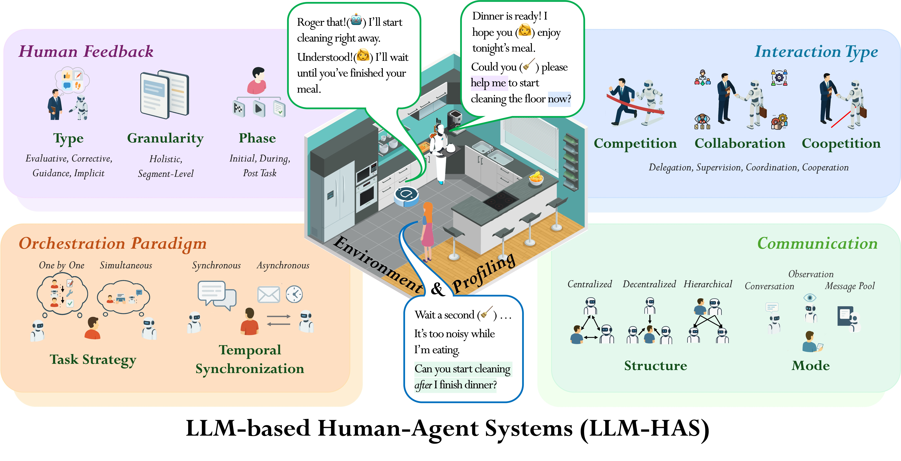

# Awesome-LLM-Based-Human-Agent-Systems
 
 

    

A Survey on Large Language Model based Human-Agent Systems

⭐ Star and stay tuned! :> Our survey paper will be publicly available on ArXiv within the next three days, and comprehensive paper lists and resources will be added here very soon.

😊 Feel free to let us know if you want all paper lists and resources even earlier~ 

<!-- omit in toc -->
## 🔥 News
- **2025.04**: 🎉🎉🎉 We have published a survey paper titled "[A Survey on Large Language Model based Human-Agent Systems](https://openreview.net/forum?id=OUsZtCgYxy)". Please feel free to cite or open pull requests for your awesome studies.

## 🌟 Introduction

Welcome to the repository associated with our survey paper, "A Survey on Large Language Model based Human-Agent Systems". This repository contains **resources and updates** related to our ongoing Human-Agent-System research. For a detailed introduction, please refer to [our survey paper](https://openreview.net/pdf?id=OUsZtCgYxy).

<!-- omit in toc -->
## 📄 Contents

- [Awesome-LLM-Based-Human-Agent-Systems](#awesome-llm-based-human-agent-systems)
  - [🌟 Introduction](#-introduction)
  - [🏆 Human Feedback](#-human-feedback)
  - [Interaction](#interaction)
  - [Orchestration](#orchestration)
  - [Communication](#communication)
  - [Applications, Datasets \& Benchmarks](#applications-datasets--benchmarks)

## 🏆 Human Feedback
| Title | Date | Code | Feedback Type | Feedback Subtype | Feedback Granularity | Feedback Phase |
| ---  | :---: | :---: | :---: | :---: | :---: | :---: |
| [Collaborative Gym: A Framework for Enabling and Evaluating Human-Agent Collaboration](https://arxiv.org/abs/2309.13007) | 2024/12 | [Link](https://github.com/SALT-NLP/collaborative-gym) | Corrective | Refinement | Segment | During Task
| [FinArena: A Human-Agent Collaboration Framework for Financial Market Analysis and Forecasting](https://arxiv.org/abs/2503.02692) | 2025/03 | - | Guidance | Demonstration | Segment | During Task

## Interaction
| Title | Date | Code | Interaction Types | Interaction Variant
| ---   | :---: | :---: | :---: | :---: |
| [Collaborative Gym: A Framework for Enabling and Evaluating Human-Agent Collaboration](https://arxiv.org/abs/2309.13007) | 2024/12 | [Link](https://github.com/SALT-NLP/collaborative-gym) | Collaboration | Supervision, Delegation
| [FinArena: A Human-Agent Collaboration Framework for Financial Market Analysis and Forecasting](https://arxiv.org/abs/2503.02692) | 2025/03 | - | Collaboration | Delegation

## Orchestration
| Title | Date | Code | Orchestration Strategy | Orchestration Synchronization 
| ---  | :---: | :---: | :---: | :---: |
| [Collaborative Gym: A Framework for Enabling and Evaluating Human-Agent Collaboration](https://arxiv.org/abs/2309.13007) | 2024/12 | [Link](https://github.com/SALT-NLP/collaborative-gym) | One-by-One | Asynchronous
| [FinArena: A Human-Agent Collaboration Framework for Financial Market Analysis and Forecasting](https://arxiv.org/abs/2503.02692) | 2025/03 | - | One-by-One | Asynchronous

## Communication
| Title | Date | Code | Communication Structure | Communication Mode 
| ---  | :---: | :---: | :---: | :---: |
| [Collaborative Gym: A Framework for Enabling and Evaluating Human-Agent Collaboration](https://arxiv.org/abs/2309.13007) | 2024/12 | [Link](https://github.com/SALT-NLP/collaborative-gym) | Decentralized | Conversation
| [FinArena: A Human-Agent Collaboration Framework for Financial Market Analysis and Forecasting](https://arxiv.org/abs/2503.02692) | 2025/03 | - | Hierarchical | Conversation

## Applications, Datasets & Benchmarks
| Domain | Datasets & Benchmarks | Proposed or Used by | Data Link |
| ---  | :---: | :---: | :---: |
Embodied AI | TaPA | TaPA ([Wu et al., 2023](https://arxiv.org/abs/2307.01848)) | [Link](https://github.com/Gary3410/TaPA) |
Embodied AI | EmboInteract|  InteractGen ([Sun et al., 2024b](https://openreview.net/forum?id=WDdiCIkpxC)) | -

